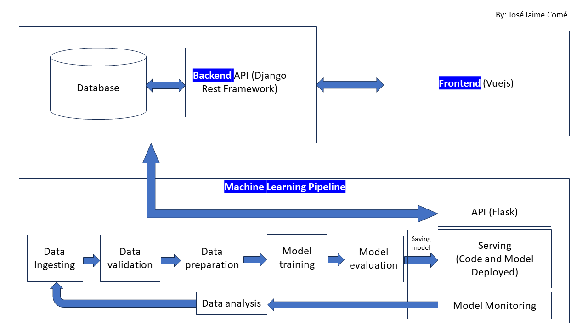

# machine-learning-full-implementation
This project aims to demostrate how to build Machine Learning Pipeline, integrate it to backend and frontend Applications.


## How it works
The first case of many that will be included in this project has iris dataset for Machine Learning. Form is filled in frontend application and 
when the form is submitted the response of predicted value is displayed. The system store both selected and predicted value.
Later these values are analysed and new data is ingested for training, testing, validation and deployment of new model with the 
aim of constantly improve the Machine Learning.


## To run the project
### Machine Learning Pipeline

Running Machine Learning Service
```sh
py run.py
```
or
```sh
flask --app hello run
```

### Backend API (Django Rest Framework)
Running Migrations
```sh
py manage.py makemigrations
py manage.py migrate
```

Running API
```sh
py manage.py runserver
```

### Frontend (Vuejs)
### Project Setup
Installation
```sh
npm install
```

Compile and Hot-Reload for Development
```sh
npm run dev
```
Server will run on [http://127.0.0.1:5173]

Compile and Minify for Production
```sh
npm run build
```
